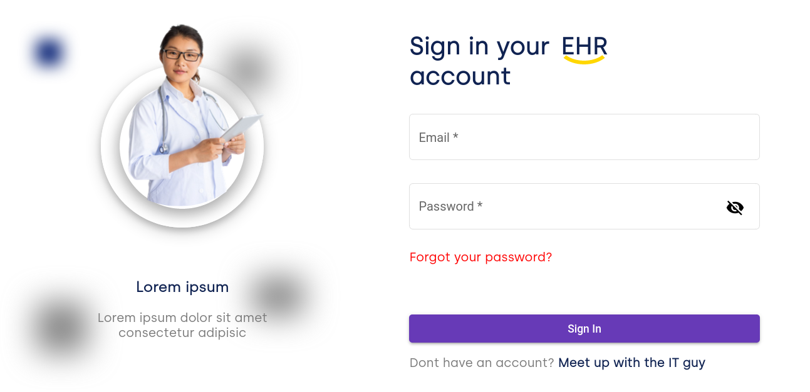

# AngularTest : Built to test angular skills

## Development server

To successfully run the app on a local development enviroment, [please ensure the server here](https://github.com/The-Professor99/fake_api_server) is running. <strong>This is important!!!</strong>

Run `ng serve` for a dev server. 

Navigate to `http://localhost:4200/`.

### Screenshot

### Links

- Live Site URL: [Check out the app here](https://angular-test99.netlify.app)
- Server URL: [The server for this project is hosted here](https://fake-server-app-angular-test.herokuapp.com/)

### Continued development
Optimizing site for faster page loads.

